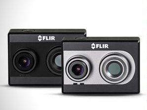
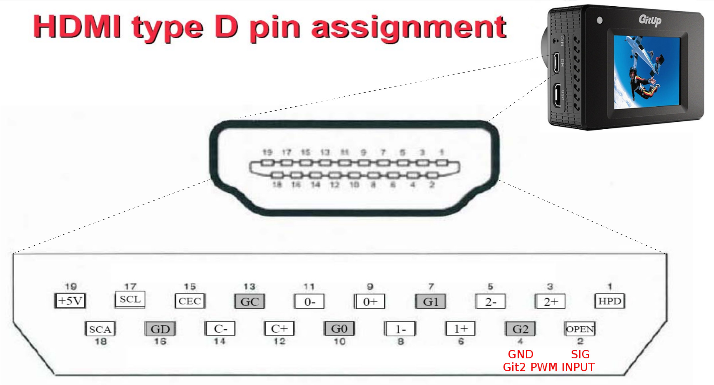

# Камеры

Подключение внешних камер и работа с ними.

## Flir Duo

Flir Duo представляет собой первое в мире компактное, легкое радиометрическое средство отображения инфракрасного и видимого спектра, разработанное для профессионального использования на частных беспилотных летательных аппаратах (дронах).

Камера имеет возможность общаться с БПЛА по протоколу MAVLink. С его помощью можно изменять настройки, посылать команды на съемку фото и видео, передавать данные о местоположении аппарата.

### Подключение

Для подключения камеры к полетному контроллеру Pixhawk необходимо воспользоваться штатным miniUSB-кабелем камеры. Соединяем выход PWM2 и PWM1 камеры с пинами RX и TX соответственно разъемов telem1 или telem2 контроллера.

Встроенного аккумулятора у камеры нет, необходимо запитать ее по usb.

### Настройка камеры

Для настройки камеры используется приложение [Flir UAS](https://play.google.com/store/apps/details?id=com.flir.vuepro&hl=ru) для мобильного телефона. Приложение взаимодействует с камерой по Bluetooth.

Для того, чтобы камера общалась с полетным контроллером по протоколу MAVLink необходимо:

- Включить bluetooth на камере (нажать на кнопку с соответствующим значком на камере - загорится синий светодиод).
- Включить приложение на телефоне, оно произведет поиск камеры.
- Подключиться к Flir Duo.
- На вкладке Controller выбрать MAVLink как протокол для общения по Serial.

### Настройка Pixhawk

Для настройки полетного контроллера используйте приложение [QGroundControl](http://qgroundcontrol.com/).​

Подключитесь к дрону, перейдите на панель настроек, на ней выберите пункт "Camera" - откроется страница настроек камеры. В выпадающем списке "Trigger Interface" выберите "MAVLink".

"Trigger mode" выберите в соответствии со своими задачами. "AUX Pins" не используются, можно оставить значения по умолчанию.

## GitUp Git2P

Камера имеет возможность удаленного управления с помощью подачи PWM сигнала на один из пинов microHDMI-порта, что делает ее подходящей для использования на беспилотниках.

### Подключение

Для управления камерой PWM-сигналами требуется специальный кабель с выводом отдельного провода и земли для подсоединения к полетному контроллеру.

Выведенный провод и земля подсоединяются к соответствующим пинам одного из указанных в разделе "Camera" AUX-выводов.

### Настройка Pixhawk

Подсоединитесь QGroundControl'ом к своему контролеру. На панели настроек в разделе  "Camera" в списке "Trigger interface" выберите "PWM".

Камера реагирует на следующие значения PWM:

- 1500 - нейтральное положение, камера ожидает следующей команды..
- 2000 - однократное фото. Чтобы сделать следующее, необходимо послать нейтральное значение (1500), а потом снова 2000.
- 1000 - начать запись видео. Для остановки необходимо послать нейтральное значение (1500), а потом снова 1000.

## Использование камер

### Ручное управление

Для получения доступа к функциям ручного управления камерами необходимо собрать прошивку из ветки нашего [репозитория](https://github.com/CopterExpress/Firmware/tree/rc_and_qgc_buttons_camera_trigger), а также собрать [QGroundControl с дополнительными кнопками на панели](https://github.com/CopterExpress/qgroundcontrol/tree/charging_station_with_camera_buttons). (TODO: собрать и залить все куда-нибудь)

#### Использование переключателей на пульте дистанционного управления

Для настройки нужного канала и значений PWM для срабатывания переключателей, используйте следующие параметры:

- TRIG_PHOTO_CHAN - канал для фотографирования.
- TRIG_PHOTO_PWM - уровень PWM для срабатывания затвора.
- TRIG_PHOTO_NTRL - фото нейтраль.
- TRIG_VIDEO_CHAN - канал для съемки видео.
- TRIG_VIDEO_PWM - уровень PWM для начала/окончания съемки.
- TRIG_VIDEO_NTRL - видео нейтраль.

Фото делается однократно при сигнале нужного уровня, чтобы сделать новое - надо сбросить в нейтраль (TRIG_NTRL) и снова послать сигнал. Видео стартует при достижении указанного сигнала и останавливается при сбросе в нейтраль.

#### Использование кнопок на панели

Для съемки фото используйте кнопку с изображением фотоаппарата. Для начала записи видео - кнопку с надписью "Start video". Для остановки записи нажмите ее снова.

### Автоматическое управление

#### Условное срабатывание вне миссий

На странице настроек камеры в QGroundControl в выпадающем списке "Trigger mode" вы можете выбрать режимы:

- "Time based, always on" - затвор будет срабатывать все время, пока включен коптер через интервалы времени, указанные в параметре TRIG_INTERVAL.
- "Distance based, always on" - затвор будет срабатывать всякий раз, когда коптер пройдет дистанцию, указанную в параметре TRIG_DISTANCE.

#### Создание миссий с использованием камер

## Добавление геоданных в изображения

Для составления фотопланов необходимо, чтобы каждое изображение содержало в себе данные о координатах съемки.

Flir Duo при работе по MAVLink умеет самостоятельно подставлять геоданные в фотографии, для других же камер необходима постобработка.

В QGroundControl есть модуль, реализующий этот функционал.

Скачайте лог и фотографии, сделанные в процессе полета. Зайдите в раздел "GeoTag Images", укажите путь к файлу лога, директории с фотографиями и (опционально) директорию для обработанных фотографий.

