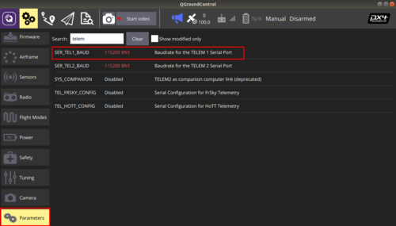

# Настройка соединения Pelican Mini - COEX Control Module

## Запись образа

1. Загрузите последние образы [NavTALink](https://drive.google.com/file/d/1gnhqKfKnWkzALMUumSkQaX9yv1H44cT0/view?usp=sharing) для коптера и [NavTALink control](https://drive.google.com/file/d/1OORAkp7-CMaF69wEJXfNFOSFZ_ZRs0Yl/view?usp=sharing) для пульта.

2. Запишите образ NavTALink на MicroSD карту и установите в Raspberry Pi на дроне.

    > **Info** Для записи можно использовать приложение [*balenaEtcher*](https://www.balena.io/etcher/).

3. Запишите образ NavTALink control на MicroSD и установите в Raspberry Pi в пульте.

    > **Info** Образы изначально преднастроены и должны связываться сразу, для большей безопасности соединения рекомендуется изменить ключи шифрования.

## Настройка образа дрона Pelican Mini

> **Hint** Все нижеприведенные команды являются командами консоли, для выполнения вышеописанных действий.

1. Включите Raspberry Pi дрона. После инициализации образа появится WiFi сеть с именем *NavTALink-0586* подключитесь к ней, стандартный пароль *navtalinkwifi*.

2. Подключитесь к системе по IP: `192.168.30.1`. Для подключения используйте любой SSH клиент. Пошаговую инструкцию о подключении с помощью Windows можно прочитать [тут](http://pelican.coex.tech/ru/latest/navtalink_setup/#putty).

3. Сгенерируйте ключи шифрования используя команду:

    ```bash
    wfb_keygen
    ```

4. В результате выполнения команды, в домашней директории `/home/pi/` появятся 2 файла ключей `gs.key` и `drone.key`, для станции управления и дрона соответственно.

    

5. Перейдите в домашнюю директорию и перенесите ключ шифрования дрона `drone.key` в директорию `/etc/` командой:

    ```bash
    cd ~/
    sudo cp grone.key /etc/
    ```

6. Вызовите команду записи идентификационного номера сетевого адаптера:

    ```bash
    sudo navtalink_update_adapter
    ```

7. Загрузите ключ шифрования станции управления `gs.key` на компьютер. Для этого используйте любой SFTP клиент или сделайте это вручную, подключив MicroSD карточку к компьютеру.

8. Удалите ключи шифрования оставшиеся на дроне:

    ```bash
    rm *.key
    ```

## Настройка образа пульта COEX Control Module

1. Подключите MicroSD карточку пульта к компьютеру и перенесите ключ `gs.key` в директорию `etc/`.

2. Установите MicroSD карточку в пульт и включите его.

3. Откройте консоль в верхнем левом углу панели задач.

    

    

4. Вызовите команду записи идентификационного номера сетевого адаптера:

    ```bash
    sudo navtalink_update_adapter
    ```

## Изменение имени сети

> **Hint** Рекомендуется изменять имя сети раздаваемого WiFi для возможности включения двух дронов в 1 месте.

1. Отредактируйте файл `/etc/wpa_suplicant/wpa_suplicant-wlan0`:

    ```bash
    sudo nano /etc/wpa_suplicant/wpa_suplicant-wlan0
    ```

2. Измените имя WiFi смети, заменив поле `ssid` на любое другое имя, к примеру *NavTALink-1234*

    

## Изменение частоты подключения адаптера

> **Hint** По умолчанию образы настроены на один и тот же канал WiFi, для одновременной работы двух дронов и пультов в 1 месте необходимо разнести их по разным каналам.

1. Отредактируйте файл `/etc/wifibroadcast.cfg`:

    ```bash
    sudo nano /etc/wpa_suplicant/wpa_suplicant-wlan0
    ```

2. Измените в нем параметр `wifi_channel`.

    

> **Caution** Данную настроку необходимо проводить на дроне и на пульте.

## Калибровка термального изображения

1. Для совмещения визуального и термального изображения отредактируйте файл `/etc/duocam/camera.yaml`.

    ```bash
    sudo nano /etc/duocam/camera.yaml
    ```

    > **Hint** Для применения внесенных изменений перезагрузите сервис *duocam-camera*, введя строку `sudo systemctl restart duocam-camera`.

2. Для настройки положения термального изображения измените параметры `x_start` и `y_start` в блоке `overlay_thermal_on_visual`. Данные параметры отвечают за горизонтальное и вертикальное положение термального изображения, слева на право и сверху вниз соответственно.

3. Для настройки температуры отображаемой на изображении, измените параметр `offset` в блоке `temperature_calibration`. Для повышения температуры измените параметр на необходимое количество градусов в большую сторону, а для уменьшения в меньшую.

    

## Настройка полетного контроллера

Скачайте последнюю версию прошивки *charging_station_1.9.2*, в репозитории https://github.com/CopterExpress/Firmware.

Последний выпущенный релиз [*v1.9.2-charging-station.4*](https://github.com/CopterExpress/Firmware/releases/tag/v1.9.2-charging-station.4).

1. Установите прошивку на дрон.

2. Во вкладке *Parameters* найдите параметр *SER_TEL1_BAUD* и установите скорость передачи 115200.

    
