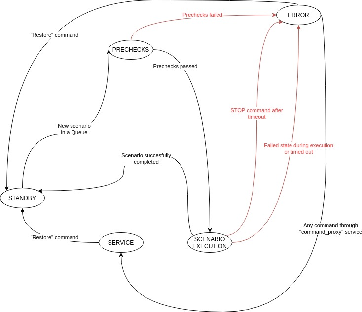
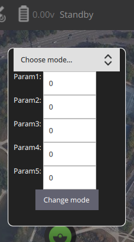
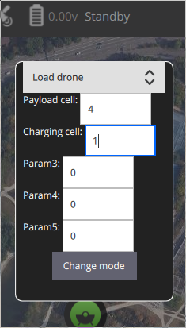
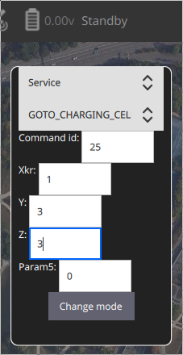

# Дронпоинт

## Логика работы

Схема состояний и переходов между ними представлена на изображении:



Описание алгоритма:

* При старте ноды Дронпоинта, (если все в порядке с оборудованием) она переходит в состояние **STANDBY** (ожидание новой команды).
* При получении команды на выполнение сценария, нода приступает к предварительным проверкам.
* В случае, если предварительные проверки не проходят, нода переходит в состояние **ERROR**.
* Если предварительные проверки проходят, нода переходит к выполнению сценария и меняет свой статус на соответствующий (например, **LOADING_DRONE**).
* Если во время выполнения сценария происходит ошибка (приходит ошибка от контроллера Дронпоинта, выходит тайм-аут на ожидание завершения команды), то нода переходит в состояние **ERROR**.
* После успешного завершения сценария нода перейдёт в состояние **STANDBY**.
* Во время выполнения сценария запросы на выполнение другого сценария будут отклоняться.
* Если нода в состоянии **ERROR**, то запросы на выполнение сценариев будут отклоняться.
* Сотояние **ERROR** - это повод изучить сообщения, пришедшие в QGC от ноды Дронпоинта и попытаться вручную исправить ситуацию.
* Для ручного управления дронпоинтом следует использовать режим **SERVICE**, позволяющий проксировать в контроллер низкоуровневые команды. Команды в этом режиме передаются как есть - нет никакого контроля их выполнения.
* После ручного исправления ошибочного состояния, следует вывести ноду из состояния **ERROR** командой **RESET**. Нода перейдёт в состояние **STANDBY** и будет готова снова выполнять сценарии.
* Во время выполнения любого сценария можно послать команду для экстренной остановки всех агрегатов - **STOP**.

## Управление Дронпоинтом с помощью QGroundControl

Кастомизированную версию для управления Дронпоинтом можно скачать в релизах форка СОЕХ: https://github.com/CopterExpress/qgroundcontrol/releases/

### Подключение

* Подключитесь к сети Дронпоинта (VPN или Wi-Fi).
* Создайте подключение в разделе Comm Links по нужному протоколу

### Виджет переключения режимов

Виджет вызывается кликом на текущий режим:



Виджет состоит из выпадающего списка режимов, текстовых полей для указания параметров режима и кнопки "Change mode", непосредственно отправляющей команду на смену режима.

### Режимы с параметрами

Некоторые режимы для своего выполнения требуют указания дополнительных параметров. Для удобства пользователя их названия появляются радом с полями ввода.

#### LOADING_DRONE, UNLOADING_DRONE

Для выполнения этого сценария необходимо указать ячейку для контейнера и зарядную ячейку для батареи:



### Режим SERVICE

В этом режиме осуществляется безусловная передача низкоуровневых команд контроллеру Дронпоинта.
> **_Замечание:_**  Для осуществления передачи команд по протоколу MAVLink, возникла необходимость сопоставить команды определённым идентификаторам. Список идентификаторов можно посмотреть в коде ноды. При добавлении новых команд в код контроллера, для возможности их запуска из QGC необходимо добавить их в список с идентификаторами.

При выборе этого режима появляется выпадающий список, в котором можно выбрать команду - её id будет помещён в поле ввода первого параметра.

При выборе команды, для удобства пользователя, необходимые для неё параметры будут подписаны:



> **_Замечание:_**  Команды **GOTO_CELL** и **GOTO_CHARGING_CELL** пришлось сделать разными, так как несмотря на то, что контроллеру для их выполнения передаётся одна и та же команда `goto_cell`, набор параметров у них отличается: координата **Х** передаётся как "х" в первом случае и как "Xkr" во втором.

## Сценарии

Сценарий - это комплексная команда Дронпоинту, подразумевающая последовательное выполнение более простых команд.

### Создание нового сценария

Сценарии хранятся в виде Python-словарей с определенным набором полей.
Файл для хранения сценариев: https://github.com/CopterExpress/ros_cs/blob/dronepoint_standalone/cs_drivers/dronepoint_driver/scripts/dronepoint_driver/dronepoint_scenarios.py

На первом уровне словаря находятся следующие поля:

```python
TestScenario = {
    'name': 'TEST', # название сценария, которое будет выводиться в информационных сообщениях
    'prechecks': {}, # предварительные проверки, которые должны быть осуществлены перед началом выполнения сценария
    'commands': [] # список команд, которые должны быть выполнены в рамках сценария (при условии прохождения предварительных проверок)
}
```

#### Предварительные проверки (блок `precheks`)

Предвартельные проверки могут быть двух типов: проверки стейтов оборудования, присылаемых контроллером Дронпоинта (`PrecheckTypes.UART_STATE`), и проверки состояния внутреннего хранилища (`PrecheckTypes.STORAGE_STATE`) (например, глобальная проверка наличия свободных ячеек или проверка наличия заряженной батареи).

Блок предварительных проверок выглядит следующим образом:

```python
'prechecks': {
        PrecheckTypes.UART_STATE: {
            ArduinoDriverStateKey.TOP_HATCH: ArduinoTopHatchDriverState.CLOSED,
            ArduinoDriverStateKey.PLATFORM_PAYLOAD: ArduinoPlatformPayloadDriverState.EMPTY,
            ArduinoDriverStateKey.CHARGING_CELL: ChargingCellState.EMPTY,
        },
        PrecheckTypes.STORAGE_STATE: {
            'state': 'empty'
        }
    },
```

"Ключи" словаря предварительных проверок UART_STATE - ключи стейтов, приходящих от контроллера Дронпоинта. Их можно найти в коде основной логики ноды Дронпоинта (https://github.com/CopterExpress/ros_cs/blob/dronepoint_standalone/cs_drivers/dronepoint_driver/scripts/dronepoint_driver/dronepoint_driver_node.py) в структуре ArduinoDriverStateKey:

```python
class ArduinoDriverStateKey(object):
    """
    Namespace for the status message keys which came from Arduino UART.
    """
    LID = 'statelid'  # DriverState message charging station lid state key
    LOCK = 'statelock'  # DriverState message charging station lock state key
    PLATFORM = 'platform_state'  # Main platform state

    Z_AXIS_STATE = 'StatusZ' # Axises states
    X_AXIS_STATE = 'StatusX'
    Y_FLAG_STATE = 'YFlag' # StatusY will not be actually changed during "GOTO_CELL" platform moving
    Y_AXIS_STATE = 'StatusY' # Actual Y position of the platform

    # State of platform payload detectors (whether payload is on the platform or not)
    PLATFORM_PAYLOAD = 'platform_payload_state'
    # State of magnets which hold the payload on platform
    PLATFORM_PAYLOAD_LOCK = "platform_payload_lock_state"
    TOP_HATCH = 'top_hatch_state'  # Top hatch (drone loading) state
    BOTTOM_HATCH = 'bottom_hatch_state'  # Bottom hatch (user loading) state
    # State of lock which holds container while user interoperates with payload
    USER_CELL_LOCK = 'user_cell_lock_state'
    CHARGING_CELL = 'chargingKR1_cells_states'  # State of charging cell (just one at the moment)
    SCALES = 'scales_state'  # Weight measuring instrument state
    LAST_COMMAND = 'last_command'  # Feedback from the Dronepoint about the last command
```

"Значения" словаря - конкретные ожидаемые значения указанных выше стейтов. Алиасы значений можно посмотреть в структурах, описывающих множество значений конкретного устройства. Например, так выглядит структура для верхнего люка:

```python
class ArduinoTopHatchDriverState:
    """
    Namespace for top (drone) hatch states.
    """
    OPEN = 'open'
    CLOSED = 'close'
```

Предварительные проверки хранилища (STORAGE_STATE) - задел на будущее, этот функционал пока не реализован.

#### Команды (блок `commands`)

Блок команд - непосредственно "тело" сценария, его основной функционал.
Примерный вид блока:

```python
{
    'type': ScenarioCommandTypes.SEND_UART,
    'command': ArduinoCommand.GOTO_CELL,
    'cell_type': CellTypes.CHARGING,
#   'cell_coordinates': {'x': 2, 'z': 9, 'y': 3},
    'timeout': 15,
    'pending_states': {
        ArduinoDriverStateKey.PLATFORM: ArduinoPlatformDriverState.ON_CELL
    },
}
```

##### Поле `type`. Тип команды

Типы команд описываются следующей структутрой:

```python
class ScenarioCommandTypes:
    """
    Types of commands in scenarios
    """
    SEND_UART = 0 # Send command to dronepoint and wait for states or timeout (default)
    SLEEP = 1 # Wait for some time
    GET_INFO = 2 # Request for something (DB or Mavlink, for example)
```

* **SEND_UART** - Команда будет отправляться непосредственно на контроллер через порт. Подавляющее большинство команд имеют именно этот тип.
* **SLEEP** - Команда, предписывающая "подождать" указанное количество секунд. Например, для ожидания действий пользователя с контейнером.
* **GET_INFO** - Получить сведения из внутреннего хранилища. Задел на будущее, пока не реализован.

##### Поле `command`. Команда для выполнения

Текущий список поддерживаемых команд можно посмотреть в структуре `ArduinoCommand`:

```python
class ArduinoCommand(object):
    """
    Namespace for the Arduino commands.
    """
    # Lid commands
    LID_OPEN = 'open'  # Open charging station lid
    LID_CLOSE = 'close'  # Close charging station lid
    LID_STOP = 'stop'  # Stop lid motor

    # Lock commands
    LOCK_RELEASE = 'uncentr'  # Release charging station lock
    LOCK_LOCK = 'centr'  # Lock charging station lock
    LOCK_STOP = 'stopcentr'  # Stop lock motor

    # Platform commands
    OPEN_TOP_HATCH = 'top_hatch_state_removing'
    CLOSE_TOP_HATCH = 'top_hatch_state_install'
    GOTO_TOP_HATCH = 'goto_top_hatch'
    GOTO_CELL = 'goto_cell'
    LOAD_CHARGING_CELL = 'chargingKR1_cover_install'
    UNLOAD_CHARGING_CELL = 'chargingKR1_cover_removing'
    LOAD_PAYLOAD_CELL = 'loadingCELL'
    UNLOAD_PAYLOAD_CELL = 'unloadingCELL'
    GET_FROM_USER = 'get_from_user'
    UNLOAD_TO_USER = 'unload_to_user'
    PARK_PLATFORM = 'park_platform'
    STOP = 'stopALL'

    # Drone and payload
    GET_PAYLOAD_FROM_DRONE = 'container_removing'
    INSERT_PAYLOAD_INTO_DRONE = 'container_insert'

    # Platform payload lock commands
    LOCK_PAYLOAD = 'lock_payload'
    RELEASE_PAYLOAD = 'release_payload'

    # Charging cell commands
    LOCK_CHARGING_CELL_LOCK = 'lock_charging_cell_lock'
    RELEASE_CHARGING_CELL_LOCK = 'release_charging_cell_lock'

    # Top hatch locking mechanizm commands
    LOCK_TOP_HATCH_LOCK = 'lock_top_hatch_lock'
    RELEASE_TOP_HATCH_LOCK = 'release_top_hatch_lock'

    # Bottom hatch commands
    OPEN_BOTTOM_HATCH = 'hatch_delivery_open'
    CLOSE_BOTTOM_HATCH = 'hatch_delivery_close'

    # User cell locking mechanizm commands
    LOCK_USER_CELL_LOCK = 'lock_user_cell_lock'
    RELEASE_USER_CELL_LOCK = 'release_user_cell_lock'
```

##### Поля для команды `goto_cell`

Для команды `goto_cell` предусмотрено два вида поведения:

* Если указан тип ячейки (`cell_type`), то координаты ячейки будут браться из внутреннего хранилища (файл *cells_states.json*)
* Если указаны непосредственно координаты ячейки (`cell_coordinates`), то в команду будут переданы именно они.

##### Поле `timeout`

В этом поле указывается время в секундах ожидания выполнения команды. Если в указанное время команда не выполнилась, нода выдаёт сообщение об ошибке и переходит в стейт **ERROR**.

##### Поле `pending_states` (ожидаемые состояния)

Аналогично пречекам стейтов контроллера.
В этом поле указываются ожидаемые стейты, означающие выполнение команды. Например, при открытии верхнего люка успешным выполнением можно считать:

* `ArduinoDriverStateKey.TOP_HATCH: ArduinoTopHatchDriverState.OPEN` - стейт верхнего люка в состоянии **ОТКРЫТ**
* `ArduinoDriverStateKey.PLATFORM_PAYLOAD: ArduinoPlatformPayloadDriverState.EMPTY` - датчик нагрузки на платформе в состоянии **ПУСТОЙ**
