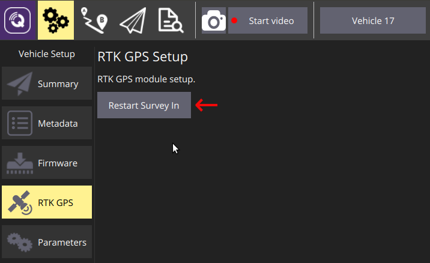

# Работа с модулем RTK GPS зарядной станции

Работа модуля RTK GPS в качестве источника позиции зарядной станции не требует предварительной настройки.

Для включения поправок RTK с зарядной станции необходимо:

1. Настроить ожидаемую длительность и точность Survey In в [параметрах зарядной станции](mavlink_cs_params.md).
2. Выполнить перезапуск процедуры Survey In в специально меню, доступном в QGroundControl для зарядной станции.
3. Дождаться завершения Survey In.

**Внимание!** После перемещения зарядной станции на новое место необходимо перезапустить процедуру Survey In.
