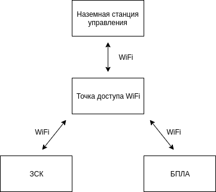
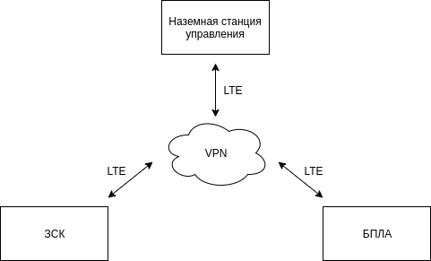

# Топология "зарядная станция, БПЛА, наземная станция управления"

Всё взаимодействие, за исключением видеотрансляции, в программно-аппаратном комплексе выполняется при помощи протокола MAVLink. В качестве транспорта для MAVLink-сообщений используется протокол UDP поверх сетей WiFi и LTE. Для объединения всех устройств в единую MAVLink-сеть и обеспечения прозрачного взаимодействия используется утилита **mavlink-fast-switch**.

Утилита устанавливается на встраиваемом компьютере зарядной станции и обеспечивает работу четырёх независимых MAVLink точек подключения:

1. ROS-узел `mavlink_cs`.
2. БПЛА.
3. Локальная точка подключения наземной станции управления.
4. Удалённая точка подключения наземной станции управления.

**Внимание!** В зависимости от конфигурации количество локальных и удалённых точек подключения наземных станций управления может варьироваться.

MAVLink-сообщения между всеми точками подключения передаются свободно, за исключением удалённой точки подключения наземной станции управления, где работает фильтр на MAVLink-сообщения:

- `GPS_RTCM_DATA`
- `HIGHRES_IMU`

Локальная точка подключения наземной станции управления предназначена для работы с системой локально, из Wi-Fi сети.

Удалённая точка подключения наземной станции управления используется для работы с системой из сети Интернет, если данная функция необходима.

На всех точках подключения активны режимы сна, чтобы избежать излишнего дублирования сообщений, когда на точках подключения нет клиентов.

## Конфигурация с использованием Wi-Fi

Предназначена для полётов на малые дистанции. На небольшом удалении от зарядной станции устанавливается точка доступа Wi-Fi, обеспечивающая равномерное покрытие сигналом зарядной станции, БПЛА и наземной станции управления.

## Конфигурация с использованием LTE

На зарядную станцию, БПЛА и наземную станцию управления устанавливаются модемы LTE, через которые все устройства подключаются к единой VPN-сети. Конфигурация предназначена для полётов на большие дистанции, но вносит ограничения на передачу мультимедийных данных.

## Конфигурация с использованием NavTALink

Работа комплекса с NavTALink требует использования дополнительного приёмника, который подключается к зарядной станции по Ethernet. NavTALink используется в качестве канала связи между БПЛА и зарядной станцией, по нему передаётся телеметрия и видеопоток. Наземная станция управления подключается к ЗСК через WiFi.

