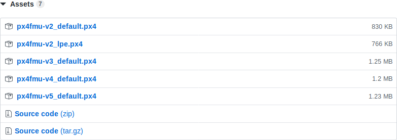

# Микропрограмма PX4 полётного контроллера с поддержкой зарядной станции

Загрузить микропрограмму с поддержкой зарядной станции можно по [ссылке](https://github.com/CopterExpress/Firmware/releases).

Для этого необходимо найти версию микропрограммы, которая содержит в названии `charging-station`.

В выбранной версии микропрограммы необходимо развернуть список файлов `Assets` и выбрать файл, соответствующий целевой платформе ([список соответствия платформ и полётных контроллеров](https://dev.px4.io/v1.8.0/en/setup/building_px4.html)).

**Внимание!** Платформа `px4fmu-v2` не поддерживает работу с **IR-Lock**.
