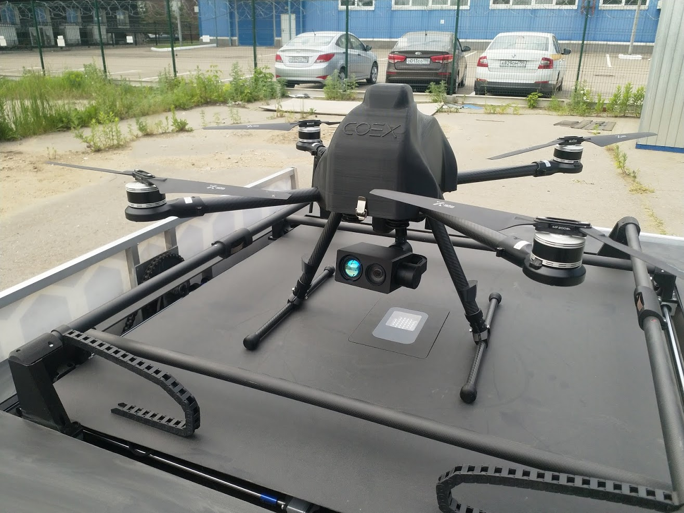
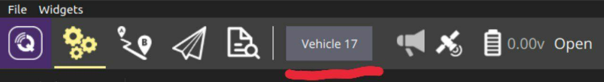
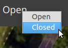

# Комплекс "Автоматика": Квадрокоптер Пеликан 3.3 с камерой Viewpro Z30TL и зарядной станцией

## Состав комплекса

В комплекс "Автоматика" входят:

* Зарядная станция
* Телекоммуникационная стойка
* Квадрокоптер "Пеликан"
* Камера Viewpro Z30TL
* Ноутбук оператора

## Схема работы

Связь всех элементов системы осуществляется через телекоммуникационную стойку. В защищенном отсеке стойки установлен роутер Teltonika RUT955. Зарядная станция подключается к роутеру ethernet-кабелем, связь с дроном осуществляется с помощью дальнобойного вай-фая, работающего в так называемом "сыром" режиме. Ноутбук оператора подключается по обыкновенному вай-фай каналу при помощи адаптера Alfa.

Управление квадрокоптером возможно только с ноутбука оператора - либо заданием автоматической миссии, либо при помощи usb-контроллера.

## Рекомендации по расположению

Расположите зарядную станцию на открытой ровной площадке. Для обеспечения наилучшего качества связи и максимальной дальности полёта дрона предпочтительно, чтобы эта площадка находилась на возвышении относительно окружающей местности (наилучшее качество связи достигается, если стойка и дрон находятся в прямой видимости друг друга). Рекомендуется, чтобы в радиусе 50 метров вокруг станции не было деревьев или строений выше 15 метров (если дрон прилетит не очень точно из-за низкого качества GPS, он будет выполнять полет по расходящимся окружностям для поиска зарядной станции). Недалеко от зарядной станции необходимо предусмотреть запасную посадочную зону радиусом не менее 20 метров для возможности аварийной посадки квадрокоптера.

Выдвените телекоммуникационную стойку на максимальную высоту. Закрепите ее к зарядной станции двумя перекладинами.

## Последовательность включения

* Подключите стойку к зарядной станции (силовой и ethernet-кабели)
* Включите зарядную станцию в сеть
* Дождитесь, пока поднимется вай-фай точка доступа SibAgroGroup-T1R
* Включите ноутбук оператора, загрузите операционную систему Ubuntu
* Подключитесь USB-вайфай адаптером Alfa к точке доступа SibAgroGroup-T1R (должно произойти автоматически). К MAC-адресу этого адаптера в роутере привязан IP-адрес, на который будут транслироваться телеметрия и видео с остальных частей комплекса (если подключиться встроенным адаптером, то телеметрия и видео на ноутбук не пойдут).
* Включите дрон (снимите крышку и подсоедините разъем XT60 аккумулятора с аналогичным разъемом на дроне. Для обеспечения возможности заряда дрона также подключите балансирный разъем аккумулятора в соответствующий разъем на дроне)
* Запустите приложение QGroundControl (QGC)
* Подождите несколько минут - если всё включилось верно, вы начнёте принимать телеметрию и видео-сигналы от дрона и зарядной станции в приложении QGC
* Если всё подключено правильно и через несколько полных перезагрузок всего комплекса и 5-10 минут ожидания соединения не происходит - обратитесь в техподдержку.

## Пульт управления

## Первый проверочный запуск

## Управление задярной станцией

Управление зарядной станцией осуществляется также через QGC. Обратите внимание, что в силу специфики работы программного обеспечения, соединение со станцией установится только ПОСЛЕ соединения с дроном (то есть, если соединение с дроном по какой-либо причине не стартует после включения комплекса, соединение со станцией также не возникнет).

Если к QGC подключено более одного устройства (дрон и станция), то на главной панели появляется виджет выбора устройства:

Наименование дрона в QGC - "Vehicle 1", зарядной станции - "Vehicle 17".

При выборе зарядной станции вы переключитесь на поток телеметрии с нее, получите возможность управления и изменения параметров. Также появится видеопоток с IP-камеры, расположенной на стойке.

Управление зарядной станцией возможно с помощью выдающего списка выбора режимов:

Нажатием на элемент управления можно перевести станцию в одно из двух состояний:

1. Open (зарядная станция открыта).
2. Closed (зарядная станция закрыта).

Станция может находиться в одном из следующих состояний:

| Состояние | Расшифровка |
| --------- | ----------- |
| Unknown | Состояние зарядной станции не определено |
| Closed | Зарядная станция закрыта |
| Opening | Зарядная станция открывается |
| Open | Зарядная станция открыта |
| Closing | Зарядная станция закрывается |

## Основной сценарий использования

## Построение миссий

## Действия в случае неполадок
