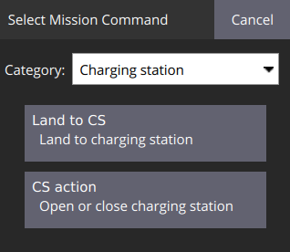
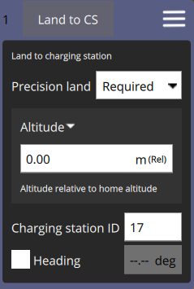

# Миссия с MAVLink-совместимой зарядной станцией

Для выполнения миссии БПЛА с зарядной станцией необходима загрузка [специализированной версии микропрограммы PX4](mavlink_uav_firmware.md) на полётный контроллер.

## Дополнительные типы путевых точек миссии

### CS action

Выполнить действие c зарядной станцией.

| Параметр | Тип | Значения | Комментарий |
| -------- | -------- | ----------- | ----------- |
| Action | | Open, Close | Действие зарядной станции |
| Charging station ID | UINT8 | > 0 | MAVLink ID зарядной станции |

В случае, если зарядная станция выполняет действие **Open**, то БПЛА ожидает открытия зарядной станции. Если за установленный временной интервал станция не будет открыта, то миссия завершится с ошибкой.

**Внимание!** Перед взлётом из зарядной станции её необходимо предварительно открыть.

### Land to CS

Выполняет посадку БПЛА в зарядную станцию.

| Параметр | Тип | Значения | Комментарий |
| -------- | -------- | ----------- | ----------- |
| Precision land | | Disabled, Required, Opportunistic | Тип точной посадкой (аналогично Land) |
| Altitude | INT | | Высота точки (аналогично Land) |
| Charging station ID | UINT8 | > 0 | MAVLink ID зарядной станции |
| Heading | FLOAT | | Направление БПЛА в точке миссии (**НЕ ИСПОЛЬЗОВАТЬ**) |

После прибытия в ориентировочную точку расположения зарядной станции коптер начнёт равнение с углом поворота, полученным от станции.

**Внимание!** Перед посадкой в зарядную станцию её необходимо предварительно открыть.
