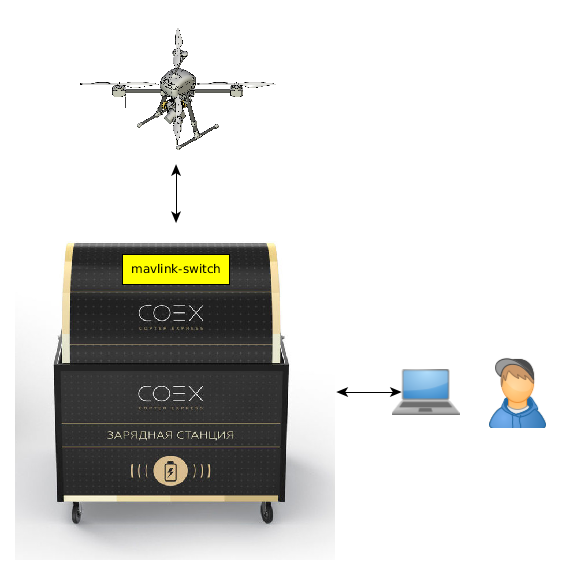

# Топология MAVLink-сети "зарядная станция, БПЛА, GCS"

Всё взаимодействие, за исключением видеотрансляции, в программно-аппаратном комплексе выполняется при помощи протокола MAVLink. В качестве транспорта для MAVLink-сообщений используется протокол UDP поверх сетей WiFi и LTE. Для объединения всех устройств в единую MAVLink-сеть и обеспечения прозрачного взаимодействия применяется утилита COEX **mavlink-switch**.

Утилита устанавливается на встраиваемом компьютере зарядной станции и обеспечивает работу четырёх независимых MAVLink точек подключения:

1. ROS-узел mavlink_cs.
2. БПЛА.
3. Локальная точка подключения GCS.
4. Удалённая точка подключения GCS.

MAVLink-сообщения между всеми точками подключения передаются свободно, за исключением удалённой точки подключения GCS, где работает фильтр на MAVLink-сообщения:

- GPS_RTCM_DATA
- HIGHRES_IMU

Локальная точка подключения GCS предназначена для подключения к системе локально, из Wi-Fi сети.

Удалённая точка подключения GCS используется для подключения к системе из сети Интернет, если данная функция необходима.

На всех точках подключения активны режимы сна, чтобы избежать лишнего дублирования сообщений, когда на точках подключения нет клиентов.

## Топология с использованием Wi-Fi

Предназначена для полётов на небольшие расстояния. На небольшом удалении от зарядной станции устанавливается точка доступа Wi-Fi, обеспечивающая равномерное покрытие сигналом зарядной станции и БПЛА.

## Топология с использованием LTE

На зарядную станцию и БПЛА устанавливаются модемы LTE, производится настройка VPN. Конфигурация предназначена для полётов на большие дистанции, но вносит ограничения на передачу мультимедийных данных.

## Гибридная топология Wi-Fi и LTE

Предназначена для полётов на большие дистации с передачей мультимедия на небольшом расстоянии от точки взлёта. В данной конфигурация телеметрия передаётся по LTE, а мультимедийные данные - по Wi-Fi.
