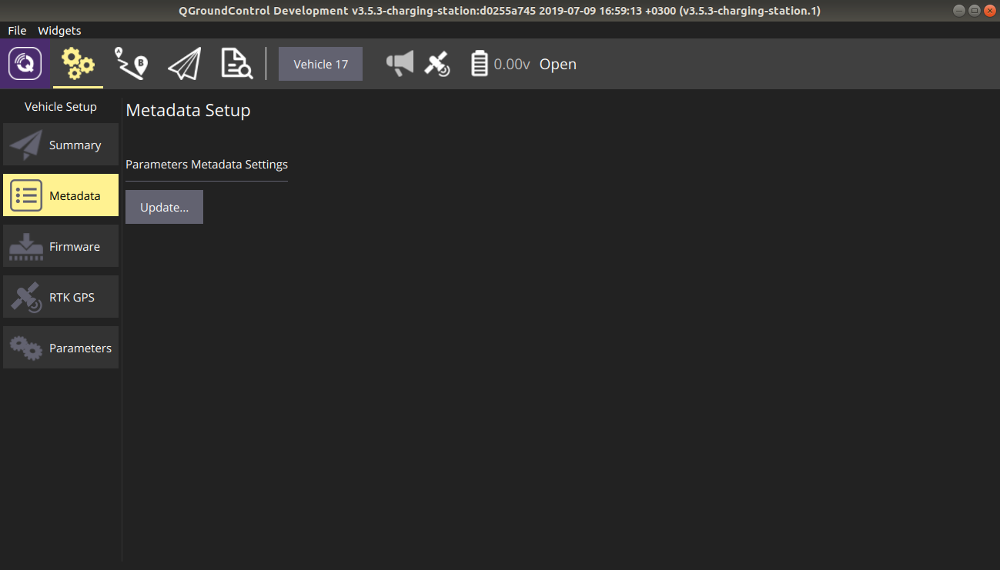
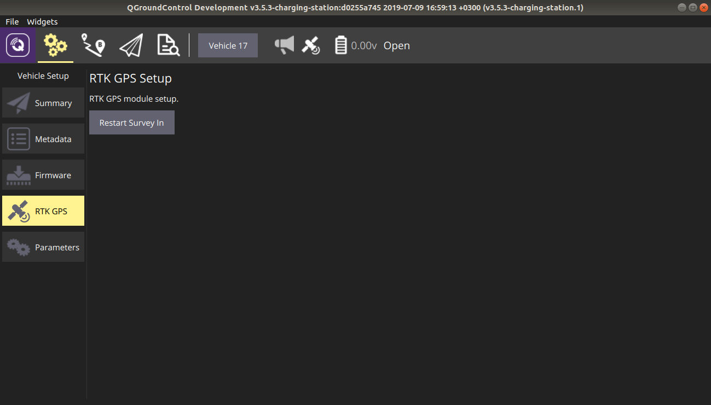

# Версия QGroundControl с поддержкой зарядной станции

Помимо поддержки миссий с зарядной станцией данная версия **QGroundControl** содержит ряд дополнительных модулей, которые полезны для работы с комплексом.

## Обновление метаданных для текущего типа устройства

Если в новой версии устройства появились параметры, которые неизвестны **QGroundControl**, их отображение будет происходить без корректной типизации и учёта ограничений на ввод. Обновить параметры можно, выполнив загрузку микропрограммы в полётный контроллер, но, в случае с зарядной станцией, это сделать невозможно. Во всех новых версиях QGroundControl обновить метаданные можно при помощи элемента настроек "*Metadata*", что полезно не только для зарядной станции, но и для БПЛА.

Для обновления метаданных необходимо:

1. Выбрать на вкладке устройство, для типа которого вы хотите обновить метаданные.
2. Зайти в меню настроек.
3. Выбрать подпункт "*Metadata*".
4. Нажать на кнопку "*Parameters Metadata Settings -> Update...*".
5. В открывшемся диалоговом окне выбрать XML-файл с новыми метаданными.
6. Переподключиться к устройству для применения новых метаданных.

## Перезапуск процедуры поиска позиции стойки RTK

Для перезапуска процедуры поиска позиции необходимо:

1. Выбрать ту зарядную станцию, для которой необходимо выполнить перезапуск процедуры.
2. Зайти в меню настроек.
3. Выбрать подпункт "*RTK GPS*".
4. Нажать на кнопку "*RTK GPS Module Setup -> Restart Survey In*".

**Внимание!** Процедура поиска позиции стойки RTK может занять значительное время, которое зависит от окружения и параметров локализации, установленных в зарядной станции.
