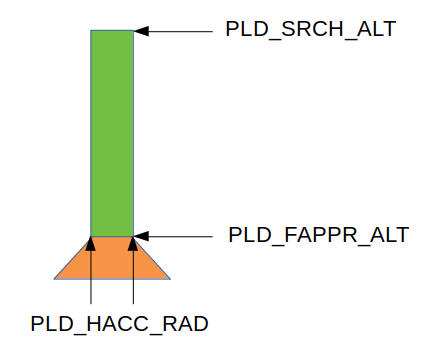

# Точная посадки в зарядную станцию

Точная посадка в зарядную станцию выполняется с помощью системы инфракрасного позиционирования [IR-Lock](https://irlock.com/).

Для улучшения посадки в сложных погодных условиях в PX4 введён ряд улучшений и новых параметров.

Перед выполнением точной посадки необходимо [включить](mavlink_uav_param_ltest_en.md) модуль локализации посадки и драйвер IR-Lock.

## Строгая точная посадка

В режиме строгой точной посадки БПЛА удерживает  радиус допуска над меткой вплоть до оконечной высоты посадки **PLD_FAPPR_ALT**.

### Точная посадка в цилиндре

Во время снижения БПЛА удерживает свою позицию в допуске **PLD_HACC_RAD**, начиная с высоты поиска метки **PLD_SRCH_ALT** до оконечной высоты посадки **PLD_FAPPR_ALT**.

### Точная посадка в воронке

Во время снижения БПЛА удерживает свою позицию в коническом допуске радиусом от **PLD_FUNNEL_TR** до **PLD_HACC_RAD**, начиная с высоты поиска метки **PLD_SRCH_ALT** до **PLD_FUNNEL_LEA**. С высоты **PLD_FUNNEL_LEA** до оконечной высоты посадки **PLD_FAPPR_ALT** БПЛА удерживает свою позицию в допуске **PLD_HACC_RAD** (посадка в цилиндре).

Каждый раз, когда БПЛА фиксирует своё смещение относительно метки более, чем на заданный допуск, то он выполняет повторную процедуру горизонтального выравнивания. Если БПЛА снижается ниже **PLD_FAPPR_ALT**, то повторных горизонтальных выравниваний не выполняется.

### Отладка точной посадки

При выполнении первых посадок рекомендуется включить параметр **PLD_INFO**, который включает передачу отладочной информации о точной посадки в GCS через MAVLink.